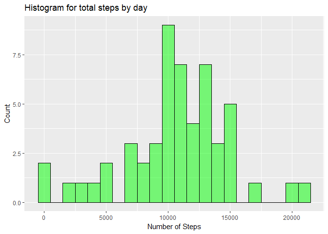
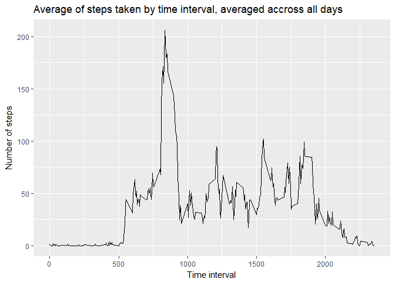
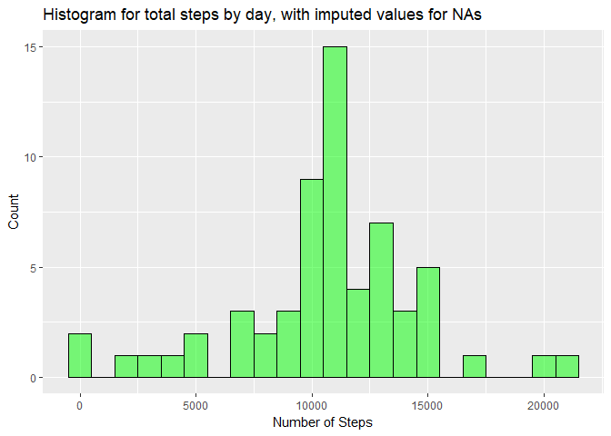
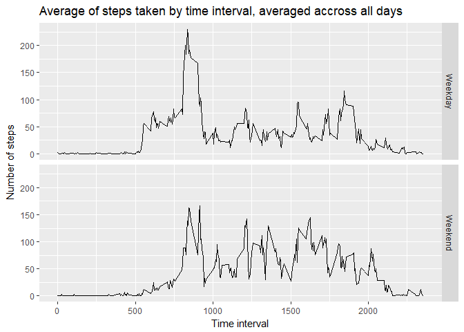

## Loading required libraries

```r
library(dplyr)
library(ggplot2)
library(lubridate)
```

## Loading and preprocessing the data
Date column is made of factors, so we convert it to classical date format.  

```r
unzip("activity.zip")
activity <- read.csv("activity.csv")
activity <- mutate(activity, date = as.Date(as.character(date)))
```


## What is mean total number of steps taken per day?

#### 1) Calculate the total number of steps taken per day.

```r
total_by_day <- activity %>% 
        group_by(date) %>%
        summarise(total_steps = sum(steps))

ggplot(data=total_by_day, aes(x=total_by_day$total_steps)) + 
  geom_histogram(binwidth = 1000,
                 na.rm = TRUE,
                 col="black", 
                 fill="green", 
                 alpha = .5) + 
  labs(title="Histogram for total steps by day", x="Number of Steps", y="Count")
```

<!-- -->

#### 2) The mean and median of the total number of steps taken per day

```r
mean_steps_by_day = mean(total_by_day$total_steps, na.rm = TRUE)
median_steps_by_day = median(total_by_day$total_steps, na.rm = TRUE)
```
1. **Mean value:** 10766.19.  
2. **Median value:** 10765.  


## What is the average daily activity pattern?

#### 1) Make a time series plot of the 5-minute interval and the average number of steps taken, averaged across all days.


```r
avg_by_interval <- activity %>% 
        group_by(interval) %>%
        summarise(avg_steps = mean(steps, na.rm = TRUE))

ggplot(data=avg_by_interval, aes(x=avg_by_interval$interval ,y=avg_by_interval$avg_steps)) + 
  geom_line() +
  labs(title="Average of steps taken by time interval, averaged accross all days", x="Time interval", y="Number of steps")
```

<!-- -->

#### 2) The 5-minute interval, that contains the maximum number of steps (on average across all days) is given by:

```r
max_interv <- filter(avg_by_interval, avg_steps == max(avg_steps))
```
1. **Interval:** 835 
2. **Average of steps:** 206.1698113


## Imputing missing values

#### 1) Number of missing values in the dataset: 

```r
missing_val <- sum(is.na(activity$steps))
```
**Missing values:** 2304

#### 2) Devise a strategy for filling in all of the missing values in the dataset: 
NA values are replaced by the mean value for the corresponding 5-minute interval (averaged accross all days). 

#### 3) Create a new dataset that is equal to the original dataset but with the missing data filled in: 


```r
activity_filled <- activity %>% 
                  group_by(interval) %>% 
                  mutate(steps = ifelse(is.na(steps), mean(steps, na.rm = T), steps))
```

#### 4) Make a histogram of the total number of steps taken each day

```r
total_by_day_filled <- activity_filled %>% 
        group_by(date) %>%
        summarise(total_steps = sum(steps))

ggplot(data=total_by_day_filled, aes(x=total_steps)) + 
  geom_histogram(binwidth = 1000,
                 na.rm = FALSE,
                 col="black", 
                 fill="green", 
                 alpha = .5) + 
  labs(title="Histogram for total steps by day, with imputed values for NAs", x="Number of Steps", y="Count")
```

<!-- -->

#### 5) Compute the mean and the median of these values.

```r
mean_steps_by_day_filled = mean(total_by_day_filled$total_steps, na.rm = TRUE)
median_steps_by_day_filled = median(total_by_day_filled$total_steps, na.rm = TRUE)
```
1. **Mean:** 10766.19.  
2. **Median:**  10766.19.

#### 6) Do these values differ from the estimates from the first part of the assignment? 
For the mean: no. But there is a slight difference in the value of the median.

#### 7) What is the impact of imputing missing data on the estimates of the total daily number of steps?
The histogram conserve roughly the same "shape" but the count for each bar is higher. This can be explained by the fact that this histogram is made based on the average total number of step by day and that we replaced the NA values with the average accross the time interval. 

## Are there differences in activity patterns between weekdays and weekends?

#### 1) Create a new factor variable in the dataset with two levels ("weekday" and "weekend") indicating whether a given date is a weekday or weekend day.


```r
activity_weekdays <- activity_filled %>%
                    mutate(day_type = as.factor(if_else(wday(date, week_start = 1) < 6, "Weekday", "Weekend")))
```

#### 2) Compute average number of steps (over all days), by 5-minutes time-interval.

```r
intervMean_weekDay <- activity_weekdays %>% 
        group_by(interval, day_type) %>%
        summarise(avg_steps = mean(steps, na.rm = TRUE))

ggplot(data=intervMean_weekDay, aes(x=interval ,y=avg_steps)) + 
  geom_line() + facet_grid(day_type ~ .) + labs(title="Average of steps taken by time interval, averaged accross all days", x="Time interval", y="Number of steps")
```

<!-- -->
